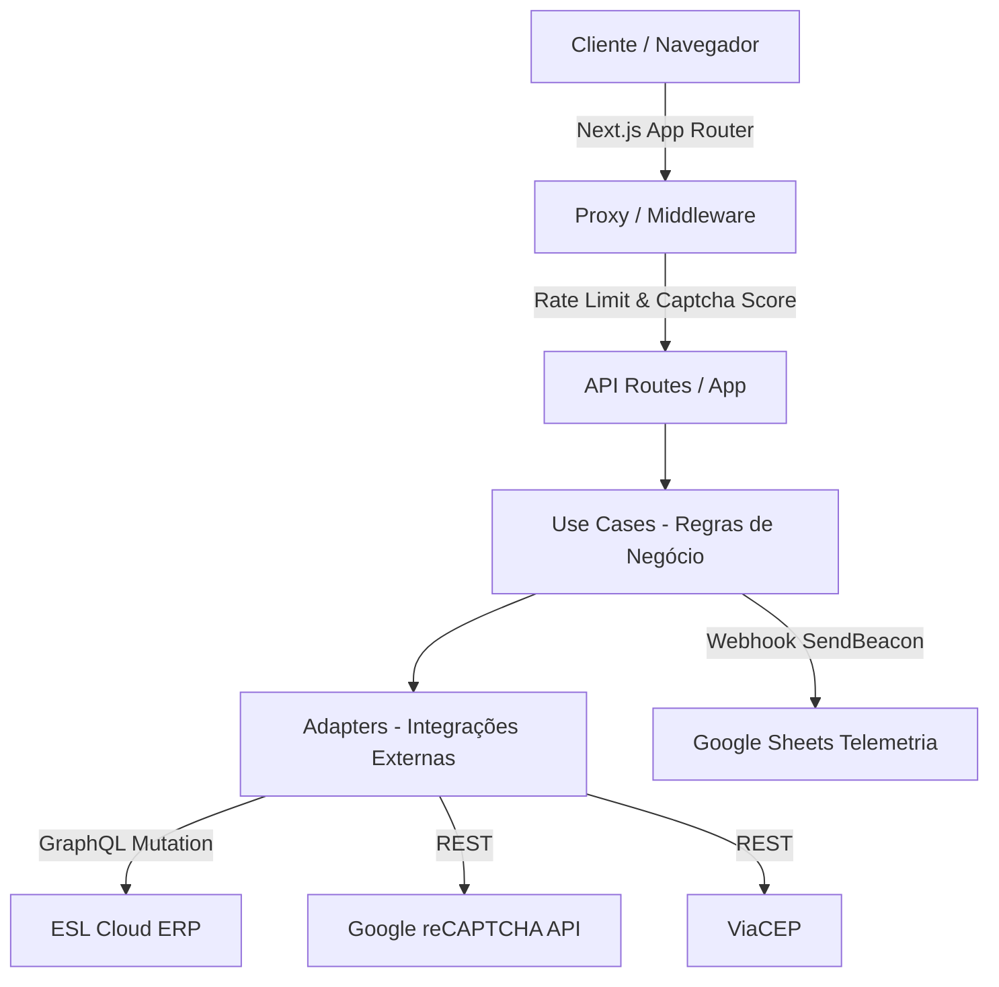

<div align="center">

# 🚚 Global Cargo — Sistema de Cotação de Frete

> **Solução inteligente e de alta performance para simulação instantânea de fretes rodoviários e aéreos, cálculo dinâmico de cubagem, validação fiscal e captura de leads em tempo real.**

<br />

[](https://nextjs.org/)
[](https://react.dev/)
[](https://www.typescriptlang.org/)
[](https://tailwindcss.com/)
[](https://zod.dev/)
[](#)
[](#-distribuição-e-uso)

</div>

---

## 📑 Sumário

- [Sobre o Projeto](#-sobre-o-projeto)
- [Demonstração](#-demonstração)
- [Principais Funcionalidades](#-principais-funcionalidades)
- [Arquitetura e Camadas](#-arquitetura-e-camadas)
- [Tecnologias Utilizadas](#-tecnologias-utilizadas)
- [Pré-requisitos](#-pré-requisitos)
- [Instalação](#-instalação)
- [Variáveis de Ambiente](#-variáveis-de-ambiente)
- [Execução](#-execução)
- [Estrutura de Pastas](#-estrutura-de-pastas)
- [Roadmap](#-roadmap)
- [Distribuição e Uso](#-distribuição-e-uso)
- [Licença](#-licença)
- [Autor](#-autor)

---

## 💡 Sobre o Projeto

O **Formulário de Cotação Global Cargo** foi desenvolvido para transformar o processo tradicional e demorado de cotações de transporte rodoviário e aéreo em uma experiência digital rápida, assertiva e moderna.

O sistema atua como uma ponte estratégica entre o cliente final e o ERP logístico (ESL Cloud), automatizando regras de negócio complexas como:
- **Cálculo de peso cubado** com suporte a regras municipais específicas (Fator 167 vs Fator 300).
- **Cálculo tributário de DIFAL** (Diferencial de Alíquota) baseado no status de contribuinte de ICMS do destinatário.
- **Validação cadastral em tempo real** de CNPJ/CPF com busca de municípios e preenchimento inteligente de endereços.
- **Funil de recuperação de leads**, registrando automaticamente dados de cotações abandonadas para a equipe comercial.

Tudo isso envelopado em uma interface interativa, construída com animações fluidas e protegida contra abusos por camadas de *Rate Limiting* e *Google reCAPTCHA v3*.

---

## 🖥️ Demonstração

<div align="center">

<!-- Inserir aqui o GIF ou Print da aplicação em funcionamento -->


*Interface responsiva e dinâmica: formulário em etapas, cálculo de cubagens em tempo real e modais de confirmação.*

</div>

---

## ✨ Principais Funcionalidades

- ⚡ **Simulação Instantânea**: Obtenção de prazos, impostos, subtotais e valor total estimado para modais Rodoviário e Aéreo.
- 📦 **Gestão Dinâmica de Cubagem**: Adição e remoção automatizada de caixas/volumes com limite inteligente baseado no total informado.
- 🗺️ **Fator de Cubagem Inteligente**: Identificação automática de cidades com fator 300 kg/m³ vs 167 kg/m³.
- 🏢 **Consulta de Documentos & Endereços**: Integração com ViaCEP e base interna GraphQL para busca de pessoas físicas e jurídicas.
- 📊 **Cálculo Automático de DIFAL**: Identificação de operações interestaduais com destinatários não contribuintes.
- 🔒 **Proteção contra Bots & Abusos**:
  - **reCAPTCHA v3** com verificação de *score* mínimo no servidor.
  - **Rate Limit por IP e Rota** via Upstash Redis (`@upstash/ratelimit`).
  - Verificação rigorosa de cabeçalhos de origem (`Origin` / `Referer`).
- 📈 **Recuperação de Abandono (Churn Tracking)**: Utilização da API nativa `navigator.sendBeacon` no evento `pagehide` para salvar cotações iniciadas mas não concluídas em planilha comercial via Webhook.
- 📝 **Emissão Direta no ERP**: Geração do `sequenceCode` oficial da cotação através de mutação GraphQL segura no backend.

---

## 🏗️ Arquitetura e Camadas

O projeto adota os princípios de **Clean Architecture** e separação de responsabilidades no backend:



- **`src/schemas/`**: Fonte única da verdade (*Single Source of Truth*) para validações com Zod compartilhadas entre cliente e servidor.
- **`src/services/server/use-cases/`**: Lógica de negócio e orquestração de fluxos (validação de captcha, verificação documental).
- **`src/services/server/adapters/`**: Adaptadores isolados para comunicação com serviços de terceiros e ERPs.
- **`src/hooks/`**: Custom hooks encapsulando lógica de formulários complexos e efeitos colaterais de UI.

---

## 🛠️ Tecnologias Utilizadas

| Categoria | Tecnologia | Finalidade |
| :--- | :--- | :--- |
| **Core & Framework** | [Next.js 16 (App Router)](https://nextjs.org/) | Framework Fullstack React com Server Components e Server Actions |
| **Linguagem** | [TypeScript 5](https://www.typescriptlang.org/) | Tipagem estática rigorosa e segurança em tempo de compilação |
| **UI & Estilização** | [Tailwind CSS v4](https://tailwindcss.com/) + [Framer Motion](https://www.framer.com/motion/) | Design moderno, responsivo e animações fluidas de etapas |
| **Formulários** | [React Hook Form](https://react-hook-form.com/) + [Zod](https://zod.dev/) | Gerenciamento de estado de formulário e validação de esquemas |
| **Máscaras** | [React-IMask](https://imask.js.org/) + [cpf-cnpj-validator](https://www.npmjs.com/package/cpf-cnpj-validator) | Máscaras de entrada (CNPJ, CPF, Moeda, Dimensões) e validação matemática de documentos |
| **Segurança & Cache** | [Upstash Redis](https://upstash.com/) + [reCAPTCHA v3](https://developers.google.com/recaptcha) | Rate limiting distribuído e mitigação de tráfego automatizado/bots |
| **Comunicação HTTP** | [Axios](https://axios-http.com/) | Requisições interceptadas com injeção automática de tokens |

---

## 📦 Pré-requisitos

Antes de iniciar, certifique-se de possuir em seu ambiente:

* [Node.js](https://nodejs.org/) (versão `20.x` ou superior recomendada)
* [pnpm](https://pnpm.io/) (versão `9.x` ou superior) — *ou npm / yarn / bun*
* Credenciais de API configuradas (ESL Cloud, Google reCAPTCHA v3 e Upstash Redis)

---

## 🚀 Instalação

1. **Clone o repositório:**
   ```bash
   git clone https://github.com/seu-usuario/formulario-cotacao.git
   cd formulario-cotacao
   ```

2. **Instale as dependências:**
   ```bash
   pnpm install
   ```

---

## ⚙️ Variáveis de Ambiente

Crie um arquivo `.env.local` na raiz do projeto e configure as chaves necessárias:

```env
# Tokens de Acesso ao ERP (ESL Cloud)
TOKEN_API=seu_token_api_rest
TOKEN_GRAPHQL_API=seu_token_api_graphql

# Configurações de Modais e Features
NEXT_PUBLIC_AIR_MODAL=true
NEXT_PUBLIC_COT_COMPLETO=true

# Google reCAPTCHA v3
NEXT_PUBLIC_RECAPTCHA_SITE_KEY=sua_chave_publica_recaptcha
RECAPTCHA_SECRET_KEY=sua_chave_privada_recaptcha

# Upstash Redis (Rate Limiting)
UPSTASH_REDIS_REST_URL=https://sua-instancia.upstash.io
UPSTASH_REDIS_REST_TOKEN=seu_token_upstash

# Webhook para Registro de Abandono (Telemetria / Churn)
GOOGLE_SHEETS_WEBHOOK_URL=https://script.google.com/macros/s/seu_id_script/exec
```

---

## 💻 Execução

### Ambiente de Desenvolvimento

Para rodar a aplicação com *Hot Reload*:

```bash
pnpm dev
```

Abra [http://localhost:3000](http://localhost:3000) em seu navegador.

### Build de Produção

Para testar o build otimizado de produção:

```bash
# 1. Compilação e verificação de tipos
pnpm build

# 2. Inicialização do servidor de produção
pnpm start
```

---

## 📂 Estrutura de Pastas

```text
formulario-cotacao/
├── public/                     # Imagens estáticas, logotipos e ícones
├── src/
│   ├── app/                    # Rotas do Next.js (App Router)
│   │   ├── api/                # API Endpoints (consultar-doc, criar-cotacao, etc.)
│   │   │   ├── consultar-doc/
│   │   │   ├── criar-cotacao/
│   │   │   ├── registrar-abandono/
│   │   │   └── simular-cotacao/
│   │   ├── globals.css         # Configurações globais de Tailwind
│   │   ├── layout.tsx          # Root Layout
│   │   └── page.tsx            # Página principal da cotação
│   ├── components/             # Componentes React modulares
│   │   ├── cards/              # Cards de exibição de resultado (Rodo / Air)
│   │   ├── forms/              # Formulários principais (Simulação & Completo)
│   │   │   └── sections/       # Seções do formulário (Endereço, Mercadoria, etc.)
│   │   ├── modals/             # Modais (Confirmação, Sucesso, Bloqueios)
│   │   └── ui/                 # Componentes visuais base (Inputs, Botões, Labels)
│   ├── constants/              # Constantes de regras (Naturezas, Termos de Uso)
│   ├── data/                   # Tabelas de dados estáticos (Cidades Fator 300)
│   ├── hooks/                  # Custom Hooks (useEndereco, useFormCompleto, etc.)
│   ├── lib/                    # Instâncias de bibliotecas (Axios interceptado)
│   ├── schemas/                # Schemas de validação Zod e tipagens inferidas
│   ├── services/               # Camada de comunicação com APIs (Client e Server)
│   │   └── server/             # Serviços restritos ao servidor (Use Cases e Adapters)
│   ├── utils/                  # Funções utilitárias (Formatação monetária, máscaras)
│   └── proxy.ts                # Middleware de segurança, Rate Limit e validação de Captcha
├── package.json
├── tsconfig.json
└── README.md
```

---

## 🗺️ Roadmap

- [x] Formulário dinâmico de cubagem com limite por volume total
- [x] Integração completa com GraphQL do ERP para criação de cotações
- [x] Sistema de proteção anti-bot com reCAPTCHA v3 e Upstash Rate Limiting
- [x] Telemetria de cotações abandonadas via Webhook e `sendBeacon`
- [ ] Implementação de suíte de testes unitários com **Vitest** para os cálculos de frete e cubagem
- [ ] Migração do cache em memória dos adapters para o **Redis**
- [ ] Substituição dos `alert()` por sistema de notificações Toast acessíveis (Sonner)
- [ ] Dashboard administrativo para visualização de métricas de conversão

---

## 🔒 Distribuição e Uso

> ### ⚠️ AVISO DE PROPRIEDADE INTELECTUAL E DIREITOS RESERVADOS
>
> **ESTE PROJETO É DE USO E DISTRIBUIÇÃO ESTRITAMENTE PRIVADA.**
> 
> * É **expressamente proibido** copiar, clonar, reproduzir, redistribuir, republicar, sublicenciar, comercializar, modificar ou disponibilizar este código-fonte, no todo ou em parte, em repositórios públicos ou qualquer outro meio, sem autorização prévia, expressa e por escrito do autor.
> * O acesso, desenvolvimento e execução deste software são restritos exclusivamente à(s) pessoa(s) e equipe expressamente autorizadas.
> * **Este projeto NÃO é de código aberto (Not Open-Source).**

---

## 📄 Licença

Copyright © 2026 **Murilo Santiago / Global Cargo**. Todos os direitos reservados.  
*Proprietary License — All Rights Reserved.*

---

## 👤 Autor

Desenvolvido com dedicação por **Murilo Santiago**.

- **LinkedIn**: [linkedin.com/in/murilosantiago](https://www.linkedin.com/) *(atualize com seu perfil)*
- **GitHub**: [@murilosantiago](https://github.com/) *(atualize com seu usuário)*
- **E-mail**: [murilod_santiago@hotmail.com](mailto:murilod_santiago@hotmail.com)

---

<div align="center">
  <sub>Construído com Next.js, React e TypeScript. © 2026 Global Cargo.</sub>
</div>
